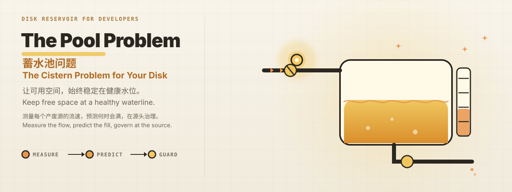
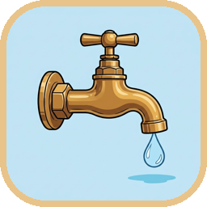
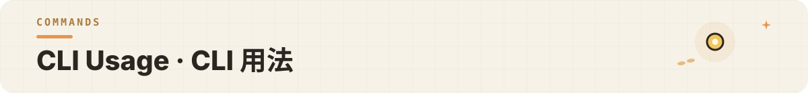

<p align="center"></p>

<p align="center">&nbsp;<a href="https://github.com/wxy/poolproblem/releases/latest"></a></p>

<p align="center"><code>macOS MENU BAR · SWIFTUI · MACOS 14+</code></p>

The Pool Problem is a disk attribution and governance tool for developers. It treats your disk as the classic cistern problem — measuring the inflow from every source of regenerable waste (Xcode build products, simulator snapshots, package-manager caches, and more), predicting when the disk will fill up, tracking why space returns after a cleanup, and governing at the source so free space stays at a healthy waterline.

> The Pool Problem 是面向开发者的磁盘“归因与治理”工具：把磁盘当作一道经典的蓄水池问题——测量各产废源（Xcode 构建产物、模拟器快照、包管理器缓存等）的流速，预测磁盘何时会满，追踪清理后空间为何回涨，并在源头治理，让可用空间稳定在健康水位。

<p align="center"></p>

| Feature 功能 | What it does 说明 |
| --- | --- |
| Space bill · 空间账单 | Attribute every GB to a tool, project, or recipe by day / week / month.<br>按日 / 周 / 月归因：每个工具、项目、配方类别产生了多少 GB。 |
| Fill prediction · 满盘预测 | Estimate when the disk will run out from the historical flow rate.<br>按历史流速预测磁盘何时会满，提前提醒。 |
| Rebound tracking · 回涨追踪 | Record how much each recipe grows back after a cleanup, answering “why is it full again”.<br>记录清理后各配方的大小回涨，回答“为什么又满了”。 |
| Waterline guard · 水线守护 | Keep free space above a target waterline (default 30 GB) with quiet, automatic cleanups.<br>保持可用空间不低于目标水位（默认 30GB），静默自动清理。 |
| Honest metering · 诚实计量 | APFS clone-aware scanning reports real reclaimable space, not surface size.<br>感知 APFS 克隆与稀疏文件，报告真实可释放空间而非表面大小。 |
| Three-level safety · 三级安全分级 | `safeWhileRunning` / `requiresQuit` / `userConfirm`, with dry-run previews before any deletion.<br>`safeWhileRunning` / `requiresQuit` / `userConfirm` 三级安全，一切删除先 dry-run 预览。 |
| Scriptable CLI · 可脚本化 CLI | `scan` / `suggest` / `clean` / `status` with stable JSON output.<br>`scan` / `suggest` / `clean` / `status` 命令，稳定 JSON 输出。 |

<p align="center"></p>

| Milestone 里程碑 | Status 状态 | Scope 范围 |
| --- | --- | --- |
| M1 Core · 核心库 | ✅ Done 完成 | `DiskReservoirCore` — recipe registry, clone-aware scanner, snapshot storage, flow analysis (attribution / rebound / growth alerts), fill prediction, rule evaluation, process detection, file deletion, and a waterline cleaning engine with measured `actualFreedBytes`.<br>`DiskReservoirCore`——配方库、扫描器（含硬链接去重）、快照存储、流量分析（归因 / 回涨 / 增长警报）、满盘预测、规则评估、进程检测、文件删除、水线清理引擎（含量规实测 `actualFreedBytes`）。 |
| M2 CLI · 命令行 | ✅ Done 完成 | `poolproblem` — `scan` / `suggest` / `clean` / `status` / `mcp` with stable JSON and MCP tools.<br>`poolproblem`——`scan` / `suggest` / `clean` / `status` / `mcp`，稳定 JSON 输出并提供 MCP tools。 |
| M3 App · 应用 | ✅ Done 完成 | SwiftUI menu-bar app — water-level panel (E-shaped gauge, sky-primary reading, layered levels), smart cleanup, novice / expert settings, notifications, Full Disk Access onboarding, launch at login, custom status-bar water icon, spring animations, accessibility.<br>SwiftUI 菜单栏应用——蓄水池水位面板（E 字型水位标尺、天空主读数、分层水位）、智能清理、傻瓜 / 专家设置、通知、完全磁盘访问引导、开机自启、自定义状态栏水位图标、弹簧动效与无障碍适配。 |
| M4 Widget · 小组件 | ⏳ Paused 暂缓 | macOS desktop widget.<br>macOS 桌面小组件。 |
| M5 Packaging · 打包 | ✅ Done 完成 | v1.1.0 — DMG + Apple notarization, distributed via GitHub Releases.<br>v1.1.0——DMG + Apple 公证，GitHub Releases 分发。 |

<p align="center"></p>

- macOS 14 or later.

    > macOS 14 及以上。

<p align="center"></p>

Download the latest release from the button above, or browse every version on [GitHub Releases](https://github.com/wxy/poolproblem/releases/latest).

> 从上方按钮下载最新版，或在 [GitHub Releases](https://github.com/wxy/poolproblem/releases/latest) 查看全部版本。

1. The DMG is **Apple-notarized** (Developer ID signature + Hardened Runtime), so it can be opened directly.

    > DMG 已通过 **Apple 公证**（Developer ID 签名 + Hardened Runtime），下载后可直接打开。

2. Open the DMG and drag `PoolProblem.app` into Applications.

    > 打开 DMG，把 `PoolProblem.app` 拖入 Applications 即可。

<p align="center"></p>

Build and run the menu-bar app (Xcode project at `PoolProblem/PoolProblem.xcodeproj`):

> 构建并运行菜单栏 App（Xcode 工程在 `PoolProblem/PoolProblem.xcodeproj`）：

```bash
xcodebuild -project PoolProblem/PoolProblem.xcodeproj -scheme PoolProblem -configuration Debug -derivedDataPath .build/xcode-derived build
open .build/xcode-derived/Build/Products/Debug/PoolProblem.app
```

Build and test the CLI:

> 构建并测试 CLI：

```bash
swift build        # build (first run fetches swift-argument-parser)
swift test         # run all tests
```

A reservoir water-level icon appears in the menu bar, updating in real time with disk usage:

> 菜单栏出现蓄水池水位图标（水位随磁盘占用实时变化）：

- Click the panel for the free-space primary reading, fill prediction, cleanable items with safety badges, and one-tap smart cleanup (preview first, then confirm).

    > 点击弹出面板：可用空间主读数、满盘预测、可清理项列表（含安全级别徽标）、一键“智能清理”（先预览后确认）。

- Settings: target waterline (default 30 GB), novice / expert mode, recipe toggles and retention days, whitelist, Full Disk Access status and onboarding, launch at login.

    > 设置：目标水位（默认 30GB）、傻瓜 / 专家模式、配方开关与保留天数、白名单、完全磁盘访问状态与引导、开机自启。

- Notifications: low space (< 20 GB), abnormal growth, action needed (for example, quit Simulator), cleanup summary.

    > 通知：空间紧张（<20GB）、异常增长、需要操作（如退出 Simulator）、清理摘要。

- Automatic scans every 30 minutes; snapshots are saved to `~/Library/Application Support/PoolProblem` or the App Group container.

    > 每 30 分钟自动扫描并保存快照（`~/Library/Application Support/PoolProblem` 或 App Group 容器）。

On first launch, grant **Full Disk Access** in System Settings → Privacy & Security so protected directories such as `~/Library/Containers` can be scanned.

> 首次使用请到 系统设置 → 隐私与安全性 → 完全磁盘访问 授权，才能扫描 `~/Library/Containers` 等受保护目录。

<p align="center"></p>

```bash
poolproblem scan               # scan every recipe, report reclaimable space
poolproblem scan --json        # machine-readable JSON
poolproblem suggest            # suggest cleanable items by rule
poolproblem clean --dry-run    # preview what would be cleaned
poolproblem clean              # clean by waterline and rules
poolproblem status             # waterline, fill prediction, recent cleanups
poolproblem mcp                # run as an MCP stdio server for AI agents
```

The CLI is also available as an MCP server. Start it with:

> CLI 也可以作为 MCP server 供其他 AI Agent 使用：

```bash
poolproblem mcp
```

Exposed MCP tools:

> 提供的 MCP tools：

- `scan`
- `suggest`
- `clean`
- `status`

Example MCP client configuration:

> MCP 客户端配置示例：

```json
{
  "mcpServers": {
    "poolproblem": {
      "command": "/path/to/poolproblem",
      "args": ["mcp"]
    }
  }
}
```

Data directory resolution order: `POOLPROBLEM_DATA_DIR` → App Group container → `~/Library/Application Support/PoolProblem`. Tests point `POOLPROBLEM_DATA_DIR` at a temporary directory for isolation.

> 数据目录解析顺序：环境变量 `POOLPROBLEM_DATA_DIR` → App Group 容器 → `~/Library/Application Support/PoolProblem`。测试通过 `POOLPROBLEM_DATA_DIR` 指向临时目录隔离。

<p align="center"></p>

**Packages · 包结构**

```text
poolproblem/
├── Sources/DiskReservoirCore/   # SwiftPM library, no UI
│   ├── Recipes/                 # recipe definitions and registry
│   ├── Scanner/                 # scanning, APFS clone-aware
│   ├── Snapshot/                # snapshot models and store
│   ├── Flow/                    # flow rates, attribution, rebound, prediction
│   ├── Cleaner/                 # cleaning engine, rule evaluation, ProcessGuard
│   └── Storage/                 # data paths (App Group / Application Support)
├── Sources/poolproblem/         # CLI: scan / suggest / clean / status / mcp
├── PoolProblem/                 # SwiftUI menu-bar app
└── Tests/                       # core and CLI tests
```

The app, CLI, and a future widget share one core library and one snapshot store; a file lock keeps the app and CLI from writing or cleaning concurrently.

> App、CLI 与未来小组件共用同一核心库与快照库；文件锁避免 App 与 CLI 同时写入或清理。

**Data flow · 数据流**

Launch / login item → permission check and onboarding (Full Disk Access) → scheduled scan → snapshot written to the shared container → growth detection / flow computation → notify or clean by rule → refresh the menu bar.

> 启动 / 开机自启 → 权限检查与引导（完全磁盘访问）→ 定时扫描 → 快照写入共享容器 → 增长检测 / 流速计算 → 需要时通知或按规则清理 → 菜单栏刷新。

<p align="center"></p>

The app ships without App Sandbox (required for system-level cleanup) and keeps everything local: configuration in UserDefaults, snapshots and logs in `~/Library/Application Support/PoolProblem` or the App Group container. Nothing is uploaded; everything stays on your Mac.

> App 未启用 App Sandbox（系统级清理所需），数据全部保存在本地：配置在 UserDefaults，快照与日志在 `~/Library/Application Support/PoolProblem` 或 App Group 容器中。不会上传任何数据。

<p align="center"></p>

APFS clone files (`cp -c`, Xcode test snapshots) share physical blocks but not inodes, so the real reclaimable space cannot be measured exactly through public APIs before deletion. Therefore:

> APFS 克隆文件（`cp -c` / Xcode 测试快照）的 inode 与资源标识不共享，但物理块共享——删除前无法用公开 API 精确测量真实可释放空间。因此：

- `reclaimableBytes` deduplicates hard links (same inode), making it an upper bound for clone-heavy directories.

    > `reclaimableBytes` 基于硬链接去重（inode 相同才去重），对克隆密集型目录是上界。

- `clean` reports both the estimate (`freedBytes`) and the measured result (`actualFreedBytes`); trust the measured number.

    > `clean` 输出同时报告估算释放（`freedBytes`）与量规实测（`actualFreedBytes`），以实测为准。

<p align="center"></p>

- M4: macOS desktop widget (paused).

    > M4：macOS 桌面小组件（暂缓）。

- App icon polish.

    > 应用图标打磨。

- FSEvents source governance.

    > FSEvents 源头治理。

<p align="center"></p>

- Design spec: [docs/superpowers/specs/2026-08-09-the-pool-problem-design.md](docs/superpowers/specs/2026-08-09-the-pool-problem-design.md)

    > 设计：[docs/superpowers/specs/2026-08-09-the-pool-problem-design.md](docs/superpowers/specs/2026-08-09-the-pool-problem-design.md)

- Implementation plan: [docs/superpowers/plans/2026-08-09-core-cli.md](docs/superpowers/plans/2026-08-09-core-cli.md)

    > 实现计划：[docs/superpowers/plans/2026-08-09-core-cli.md](docs/superpowers/plans/2026-08-09-core-cli.md)

<p align="center"></p>

Contributions are welcome! Please read [CONTRIBUTING.md](CONTRIBUTING.md) and [CLA.md](CLA.md) first.

> 欢迎贡献！请先阅读 [CONTRIBUTING.md](CONTRIBUTING.md) 与 [CLA.md](CLA.md)。

Before submitting a Pull Request, add your GitHub username to `.github/CLA_SIGNERS` — this counts as signing the Contributor License Agreement, and CI enforces the `CLA` status check.

> 提交 Pull Request 前，请将你的 GitHub 用户名添加到 `.github/CLA_SIGNERS`，即视为签署贡献者许可协议；CI 的 `CLA` 状态检查会强制校验。

<p align="center"></p>

Released under the [Apache License 2.0](LICENSE). Copyright © 2026 xingyu wang.

> 本项目以 [Apache License 2.0](LICENSE) 发布。Copyright © 2026 xingyu wang。
